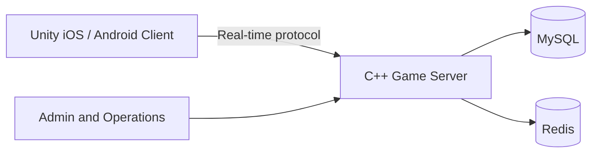

[简体中文](README.md) | [繁體中文](README.zh-TW.md) | [English](README.en.md)

# Complete Unity and C++ Texas Holdem Poker Solution|Texas Hold'em Poker Source Code

[](https://unity.com/)
[](https://isocpp.org/)
[](#technology-architecture)
[](LICENSE)


A complete Texas Hold'em poker solution for real-time multiplayer products. The repository includes a Unity client, C++ game-server components, MySQL and Redis integration, poker clubs, alliances, private rooms, MTT and SNG tournaments, hand histories, and operations modules.


> Project materials state that the system ran in a production environment for more than two years and supports over ten game modes. Independently validate deployment requirements, concurrency capacity, and third-party dependencies before use.


## Core Features


| Category | Features |
| --- | --- |
| Poker modes | Texas Hold'em, Omaha, Short Deck, Pineapple, MTT, SNG, and Cowboy Poker |
| Club ecosystem | Poker clubs, alliances, agents, private rooms, friend games, and club-coin management |
| Real-time play | Two-to-six-player tables, real-time messages, a custom protocol, and reconnect state handling |
| Tournament system | Multi-table tournaments, sit-and-go events, registration, and ranking workflows |
| Extended features | Insurance, hand histories, training bots, real-time voice, video chat, and gifts |
| Operations | Admin panel, top-up workflows, store, leaderboards, and user-order management |


## Technology Architecture


| Component | Technology and responsibility |
| --- | --- |
| Client | Unity and C# for iOS and Android |
| Game server | C++ for rooms, hand state, betting, settlement, and real-time messaging |
| Data layer | MySQL for persistent data and Redis for cache and sessions |
| SDK and platform | Android SDK, iOS workspace, client assets, and editor tooling |
| Deployment | Cloud or physical-server deployment; verify exact dependencies in the supplied code |





## Repository Layout


```text
Android SDK/client/       Android client SDK
ColiSDK.xcworkspace/      iOS workspace
ColiSDK_Runner/           iOS SDK runner
AssetGraphs/              Unity asset dependency configuration
Editor/                   Unity editor tools
Screenshots/              Product screenshots
Doc/                      Original project documentation
docs/                     GitHub Pages and technical documentation
*.cpp / *.h               C++ game-server modules
```


## Screenshots


  
**Create Club**


  
**Join Club**


  
**Club Coin Management**


  
**Join Alliance**


  
**Private Game Room**


  
**Two-to-Six-Player Real-Time Table**


  
**MTT Tournament**


  
**Player Profile**


## Documentation


- [Texas Hold'em Source Code Overview](docs/texas-holdem-source-code.md)
- [C++ Poker Game Server](docs/poker-game-server.md)
- [Product Features](docs/features.html)
- [System Architecture](docs/architecture.html)
- [Deployment and Acceptance](docs/deployment.html)
- [GitHub Pages Project Site](https://masterai-top.github.io/TexasHoldem-Poker-Complete-Solution/)


The existing MTT, SNG, Unity, poker-club, and multiplayer-poker documents remain available in the `docs/` directory.


## Related MasterAI Poker Projects


- [MasterAI Project Profile](https://github.com/masterai-top)
- [Texas Hold'em Tournament Event Platform](https://github.com/masterai-top/Texas-Holdem-Poker-Tournament-Event-Platform)
- [Texas Hold'em Game ](https://github.com/masterai-top/Texas-Hold-em-Points-Lobby)
- [CFR Texas Hold'em Poker AI](https://github.com/masterai-top/cfr-poker-ai-masterai)


## License and Compliance


Read [LICENSE](LICENSE) before using this repository. The current license includes learning, research, and demonstration terms plus a separate commercial-license requirement; it is not the unrestricted standard MIT License. Commercial deployment, payments, privacy, protection of minors, game rules, and regional regulatory requirements must be reviewed independently by the user.


Do not commit production passwords, keys, certificates, real user data, or payment configuration to a public repository. Report vulnerabilities privately according to [SECURITY.md](SECURITY.md).


## Contact


- **Telegram:** [@xuzongbin001](https://t.me/xuzongbin001)
- **Email:** [masterai918@gmail.com](mailto:masterai918@gmail.com)


If this project is useful to you, star the repository and follow future updates.
