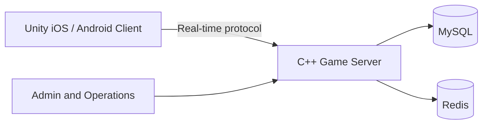

[简体中文](README.md) | [繁體中文](README.zh-TW.md) | [English](README.en.md)

# Unity 与 C++ 德州扑克完整解决方案|德州源码|Texas Hold'em Poker Source Code

[](https://unity.com/)
[](https://isocpp.org/)
[](#技术架构)
[](LICENSE)


面向多人实时游戏的德州扑克完整解决方案，包含 Unity 客户端、C++ 服务端、MySQL 与 Redis 数据层，以及俱乐部、联盟、私人房、MTT、SNG、战绩和运营管理模块。


> 项目资料显示，该系统曾在生产环境持续运行两年以上，支持十余种游戏模式。实际部署能力、并发规模和第三方依赖请在使用前独立验收。


## 核心功能


| 分类 | 功能 |
| --- | --- |
| 扑克玩法 | 德州扑克、奥马哈、短牌、大菠萝、MTT、SNG、牛仔德州 |
| 俱乐部生态 | 俱乐部、联盟、代理、私人房、好友局和俱乐部币管理 |
| 实时对战 | 2 至 6 人牌桌、实时消息、自定义通信协议和断线状态处理 |
| 赛事系统 | 多桌锦标赛 MTT、坐满即玩 SNG、报名和排名流程 |
| 扩展功能 | 保险、战绩统计、机器人陪练、实时语音、视频聊天和礼物系统 |
| 运营管理 | 管理员面板、充值、商城、排行榜和用户订单管理 |


## 技术架构


| 组件 | 技术与职责 |
| --- | --- |
| 客户端 | Unity、C#，支持 iOS 与 Android |
| 游戏服务端 | C++，负责房间、牌局状态、下注、结算和实时消息 |
| 数据层 | MySQL 持久化数据，Redis 负责缓存与会话 |
| SDK 与平台 | Android SDK、iOS Workspace、客户端资源和编辑器工具 |
| 部署 | 支持云服务器或物理机部署，具体依赖以实际代码和环境为准 |





## 主要目录


```text
Android SDK/client/       Android 客户端 SDK
ColiSDK.xcworkspace/      iOS Workspace
ColiSDK_Runner/           iOS SDK Runner
AssetGraphs/              Unity 资源依赖配置
Editor/                   Unity 编辑器工具
Screenshots/              产品真实截图
Doc/                      原始项目文档
docs/                     GitHub Pages 与技术文档
*.cpp / *.h               C++ 游戏服务端模块
```


## 游戏截图


  
**创建俱乐部界面 | Create Club**


  
**申请加入俱乐部 | Join Club**


  
**俱乐部币管理 | Club Coin Management**


  
**加入联盟 | Join Alliance**


  
**好友局房间 | Private Game Room**


  
**2 至 6 人实时牌桌 | Multiplayer Poker Table**


  
**MTT 多桌锦标赛 | MTT Tournament**


  
**个人中心 | Player Profile**


## 文档


- [德州扑克源码概览](docs/texas-holdem-source-code.md)
- [C++ 游戏服务端说明](docs/poker-game-server.md)
- [产品功能页面](docs/features.html)
- [系统架构页面](docs/architecture.html)
- [部署与验收页面](docs/deployment.html)
- [GitHub Pages 项目网站](https://masterai-top.github.io/TexasHoldem-Poker-Complete-Solution/)


仓库中原有的 MTT、SNG、Unity、俱乐部和多人扑克专题文档继续保留在 `docs/` 目录。


## MasterAI 相关德州扑克项目


- [MasterAI 项目主页](https://github.com/masterai-top)
- [德州扑克赛事平台](https://github.com/masterai-top/Texas-Holdem-Poker-Tournament-Event-Platform)
- [德州金币大厅](https://github.com/masterai-top/Texas-Hold-em-Points-Lobby)
- [CFR 德州扑克 AI](https://github.com/masterai-top/cfr-poker-ai-masterai)


## 授权与合规


请在使用前阅读 [LICENSE](LICENSE)。当前许可证包含学习、研究、演示用途和单独商业授权要求，不属于未经限制的标准 MIT 许可证。商业部署、支付、隐私、未成年人保护、游戏规则及地区监管要求必须由使用者独立审核。


不要把生产环境密码、密钥、证书、真实用户数据或支付配置提交到公开仓库。安全问题请按照 [SECURITY.md](SECURITY.md) 私下报告。


## 联系方式


如需技术合作请联系：


- **Telegram：** [@xuzongbin001](https://t.me/xuzongbin001)
- **Email：** [masterai918@gmail.com](mailto:masterai918@gmail.com)


如果该项目对你有参考价值，欢迎 Star 并关注后续更新。
