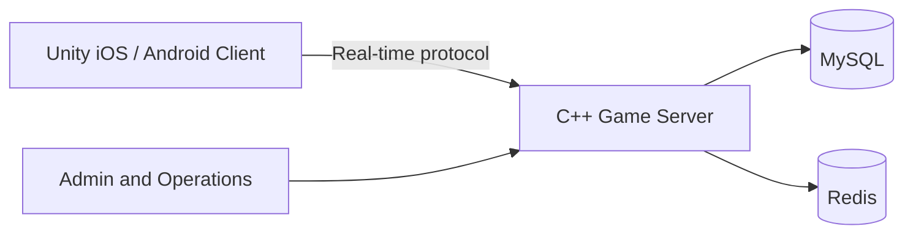

# 德州撲克完整解決方案｜Texas Hold'em Poker Source Code

[簡體中文](README.md) | [English](README.en.md) | **繁體中文**

[](https://unity.com/)
[](https://isocpp.org/)
[](#技術架構)
[](LICENSE)

面向多人即時遊戲的德州撲克完整解決方案，包含 Unity 用戶端、C++ 伺服器、MySQL 與 Redis 資料層，以及俱樂部、聯盟、私人房、MTT、SNG、戰績和營運管理模組。

> 專案資料顯示，此系統曾在正式環境持續運行兩年以上，並支援十餘種遊戲模式。實際部署能力、並行規模和第三方相依套件，請在使用前獨立驗收。

## 核心功能

| 分類 | 功能 |
| --- | --- |
| 撲克玩法 | 德州撲克、奧馬哈、短牌、大菠蘿、MTT、SNG、牛仔德州 |
| 俱樂部生態 | 俱樂部、聯盟、代理、私人房、好友局和俱樂部幣管理 |
| 即時對戰 | 2 至 6 人牌桌、即時訊息、自訂通訊協定和斷線狀態處理 |
| 賽事系統 | 多桌錦標賽 MTT、坐滿即玩 SNG、報名和排名流程 |
| 擴充功能 | 保險、戰績統計、機器人陪練、即時語音、視訊聊天和禮物系統 |
| 營運管理 | 管理員面板、儲值、商城、排行榜和使用者訂單管理 |

## 技術架構

| 元件 | 技術與職責 |
| --- | --- |
| 用戶端 | Unity、C#，支援 iOS 與 Android |
| 遊戲伺服器 | C++，負責房間、牌局狀態、下注、結算和即時訊息 |
| 資料層 | MySQL 持久化資料，Redis 負責快取與工作階段 |
| SDK 與平台 | Android SDK、iOS Workspace、用戶端資源和編輯器工具 |
| 部署 | 支援雲端伺服器或實體主機部署，實際相依項目以程式碼和環境為準 |



## 主要目錄

```text
Android SDK/client/       Android 用戶端 SDK
ColiSDK.xcworkspace/      iOS Workspace
ColiSDK_Runner/           iOS SDK Runner
AssetGraphs/              Unity 資源相依設定
Editor/                   Unity 編輯器工具
Screenshots/              產品實際截圖
Doc/                      原始專案文件
docs/                     GitHub Pages 與技術文件
*.cpp / *.h               C++ 遊戲伺服器模組
```

## 遊戲截圖

  
**建立俱樂部｜Create Club**

  
**申請加入俱樂部｜Join Club**

  
**俱樂部幣管理｜Club Coin Management**

  
**加入聯盟｜Join Alliance**

  
**好友局房間｜Private Game Room**

  
**2 至 6 人即時牌桌｜Multiplayer Poker Table**

  
**MTT 多桌錦標賽｜MTT Tournament**

  
**個人中心｜Player Profile**

## 文件

- [德州撲克原始碼概覽](docs/texas-holdem-source-code.md)
- [C++ 遊戲伺服器說明](docs/poker-game-server.md)
- [產品功能頁面](docs/features.html)
- [系統架構頁面](docs/architecture.html)
- [部署與驗收頁面](docs/deployment.html)
- [GitHub Pages 專案網站](https://masterai-top.github.io/TexasHoldem-Poker-Complete-Solution/)

儲存庫中原有的 MTT、SNG、Unity、俱樂部和多人撲克專題文件會繼續保留在 `docs/` 目錄。

## MasterAI 相關德州撲克專案

- [MasterAI 專案主頁](https://github.com/masterai-top)
- [德州撲克賽事平台](https://github.com/masterai-top/Texas-Holdem-Poker-Tournament-Event-Platform)
- [德州撲克遊戲伺服器與俱樂部系統](https://github.com/masterai-top/Texas-Holdem-Poker-Game-Server-Club-Source-Code)
- [CFR 德州撲克 AI](https://github.com/masterai-top/cfr-poker-ai-masterai)

## 授權與合規

使用前請閱讀 [LICENSE](LICENSE)。目前授權條款包含學習、研究、展示用途及另外取得商業授權的要求，並非不受限制的標準 MIT License。商業部署、支付、隱私、未成年人保護、遊戲規則及地區監管要求，必須由使用者獨立審查。

請勿將正式環境密碼、金鑰、憑證、真實使用者資料或支付設定提交至公開儲存庫。安全問題請依照 [SECURITY.md](SECURITY.md) 私下回報。

## 聯絡方式

如需技術合作、授權使用、部署評估或客製開發，請聯絡：

- **Telegram：** [@xuzongbin001](https://t.me/xuzongbin001)
- **Email：** [masterai918@gmail.com](mailto:masterai918@gmail.com)

如果此專案對你有參考價值，歡迎加上 Star 並關注後續更新。
